Class 05: Graphics and Plots with R
================
Amy Prichard
January 25th, 2019

This is some narrative text that I can style **bold** and *italic* and add links to [webpages](https://rmarkdown.rstudio.com/articles_report_from_r_script.html)
----------------------------------------------------------------------------------------------------------------------------------------------------------------

**Section 2A**: *LINE PLOT*

``` r
weight<-read.table("bimm143_05_rstats/weight_chart.txt", header=TRUE)
        # header=TRUE reads in the first lines as column names
plot(weight, pch=15, cex=1.5, lwd=2, ylim=c(2,10), xlab="Age (months)", ylab="Weight (kg)", main="Baby Weight vs. Age", type="o")
```

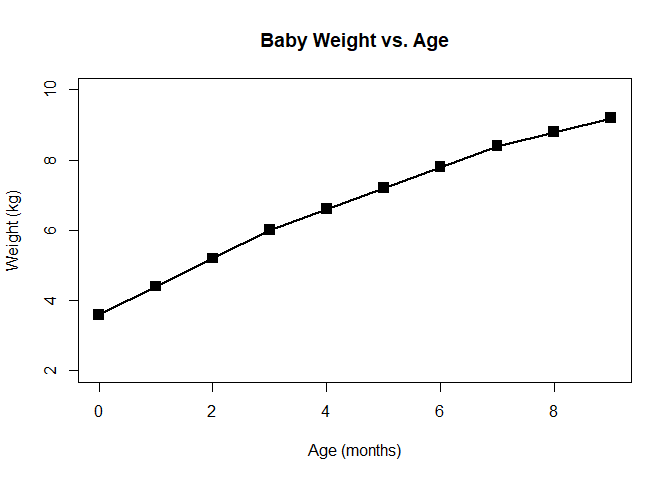

**Section 2B**: *BARPLOT*

``` r
features<-read.table("bimm143_05_rstats/feature_counts.txt", header=TRUE, sep="\t")
                    # this one is tab-delimited
barplot(features$Count)
```


``` r
par(mar=c(5,11,4,6))  # changes margins for subsequent plots
barplot(features$Count, horiz=TRUE, ylab="", names.arg=features$Feature, main="Number of Features in the Mouse GRCm38 Genome", las=1)
```

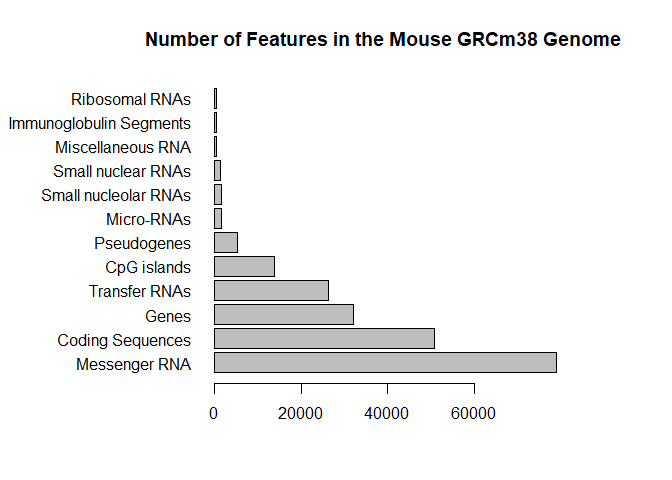

``` r
par(mar=c(5.1,4.1,4.1,2.1))  # reset par() for the next plot
```

**Section 2C**: *HISTOGRAMS*

``` r
hist(c(rnorm(10000),rnorm(10000)+4),breaks=50, main="sample histogram", ylab="", xlab="")
```

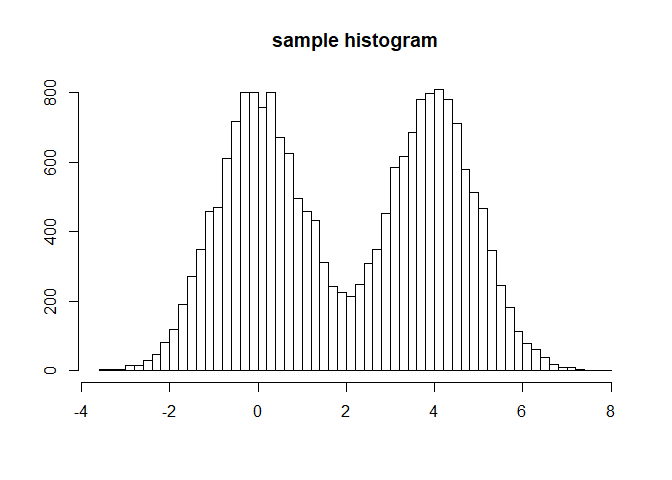

**Section 3A**: *PROVIDING COLOR VECTORS*

``` r
D<-read.delim("bimm143_05_rstats/male_female_counts.txt")
   # shorthand version of read.table() that has defaults header=TRUE and sep="\t"
bar_color<-rainbow(nrow(D))
barplot(D$Count, col=bar_color, ylab="Counts", names.arg=D$Sample, las=3)  # rainbow plot... just for kicks
```

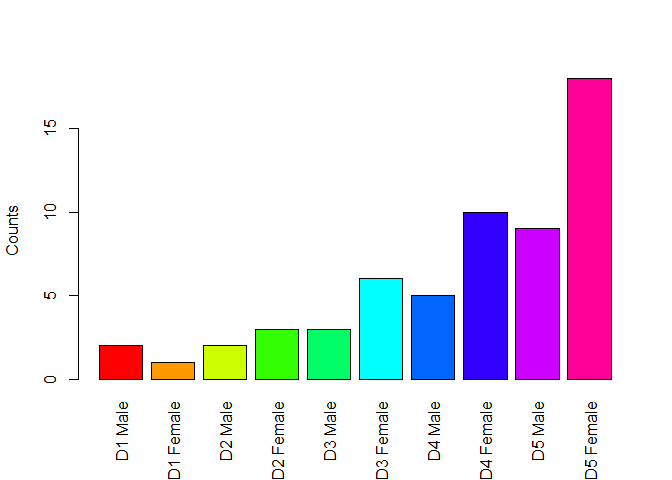

``` r
barplot(D$Count, col=c("cyan","magenta"), ylab="Counts", names.arg=D$Sample, las=3)
```

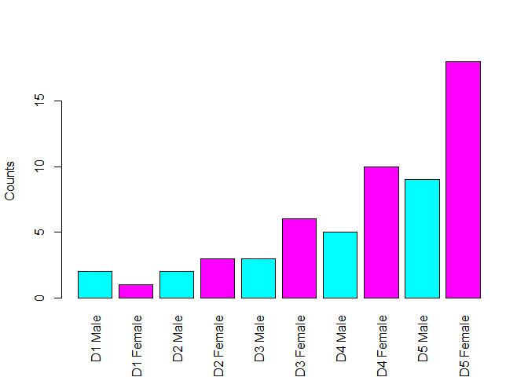

``` r
# Need more color schemes? Install Colorspace!
# install.packages("colorspace")
```

**Section 3B**: *COLORING BY VALUE*

``` r
genes<-read.delim("bimm143_05_rstats/up_down_expression.txt")
table(genes$State)  # down: 72, unchanging: 4997, up: 127
```

    ## 
    ##       down unchanging         up 
    ##         72       4997        127

``` r
defaultpalette<-palette()          # save default palette
palette(c("blue", "gray", "red"))  # change palette colors for the graph
plot(genes$Condition1, genes$Condition2, col=genes$State, xlab="Expression Condition 1", ylab="Expression Condition 2")
```

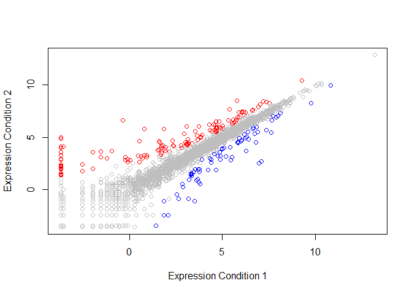

``` r
palette(defaultpalette)            # reset palette colors
```

**Section 3C**: *DYNAMIC USE OF COLOR*

``` r
methylation<-read.delim("bimm143_05_rstats/expression_methylation.txt")
nrow(methylation)  # 9241
```

    ## [1] 9241

``` r
plot(methylation$gene.meth, methylation$expression)  # difficult to interpret
```

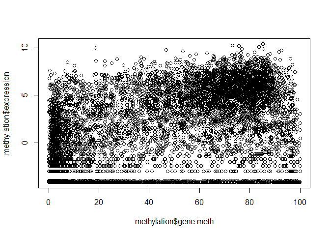

``` r
heatmap_blue<-densCols(methylation$gene.meth, methylation$expression)
plot(methylation$gene.meth, methylation$expression, col=heatmap_blue)  # so many zeros!
```

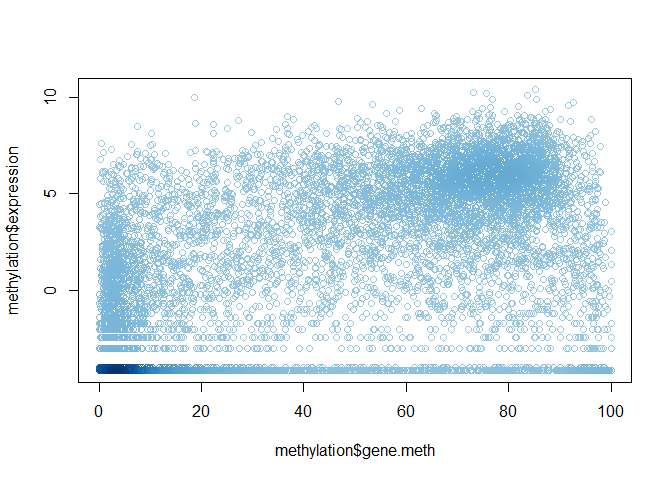

``` r
posexpr<-methylation$expression>0
heatmap_blue2<-densCols(methylation$gene.meth[posexpr], methylation$expression[posexpr])
plot(methylation$gene.meth[posexpr], methylation$expression[posexpr], col=heatmap_blue2)  # nice!
```

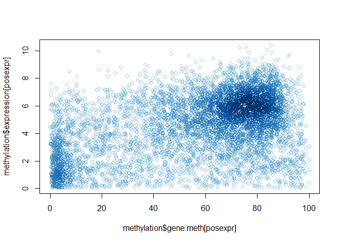

``` r
heatmap_color<-densCols(methylation$gene.meth[posexpr], methylation$expression[posexpr], colramp=colorRampPalette(c("blue", "green", "yellow", "red")))
plot(methylation$gene.meth[posexpr], methylation$expression[posexpr], col=heatmap_color)  # colorful!
```

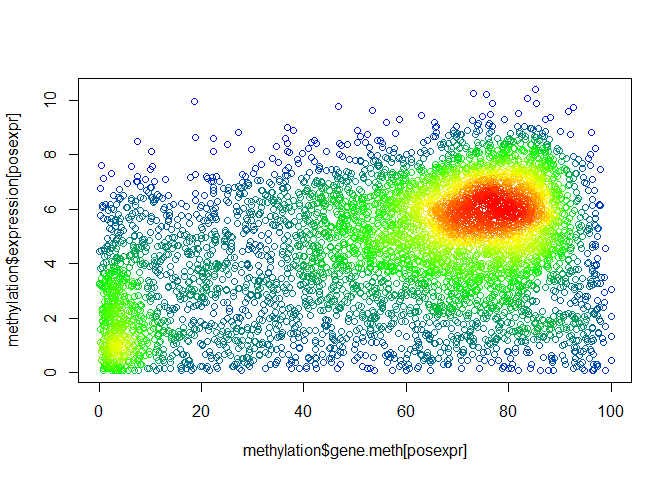

``` r
plot(methylation$gene.meth[posexpr], methylation$expression[posexpr], col=heatmap_color, pch=20)  # filled circles
```

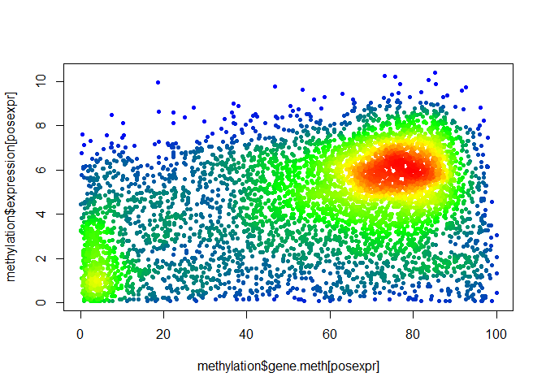

**Section 4**: *MAPPING COLORS*

``` r
# function from color_to_value_map.r
map.colors <- function (value,high.low,palette) {
  proportion <- ((value-high.low[1])/(high.low[2]-high.low[1]))
  index <- round ((length(palette)-1)*proportion)+1
  return (palette[index])
}
# plot promoter vs gene from methylation dataset
plot(methylation$promoter.meth, methylation$gene.meth, xlab="Promoter Methylation", ylab="Gene Methylation")
```

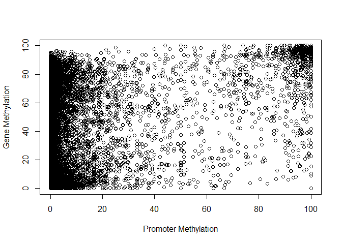

``` r
shadesofgred<-colorRampPalette(c("gray","red"))
shadesofgred100<-colorRampPalette(c("gray","red"))(100)
gred<-map.colors(methylation$expression,c(max(methylation$expression),min(methylation$expression)),shadesofgred100)
plot(methylation$promoter.meth, methylation$gene.meth, xlab="Promoter Methylation", ylab="Gene Methylation", col=gred)  # red and gray points
```

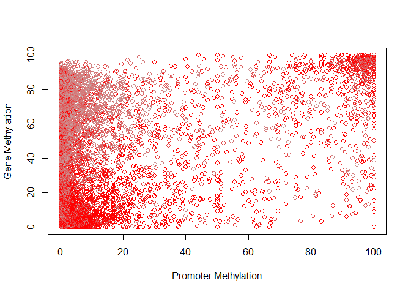

``` r
plot(methylation$promoter.meth, methylation$gene.meth, xlab="Promoter Methylation", ylab="Gene Methylation", col=map.colors(methylation$expression,c(max(methylation$expression),min(methylation$expression)),colorRampPalette(c("blue","red"))(100)))  # red and blue points
```

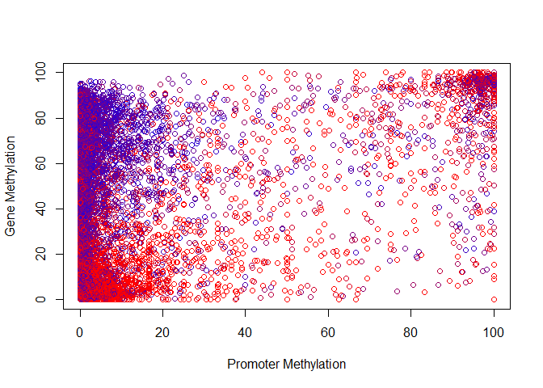
