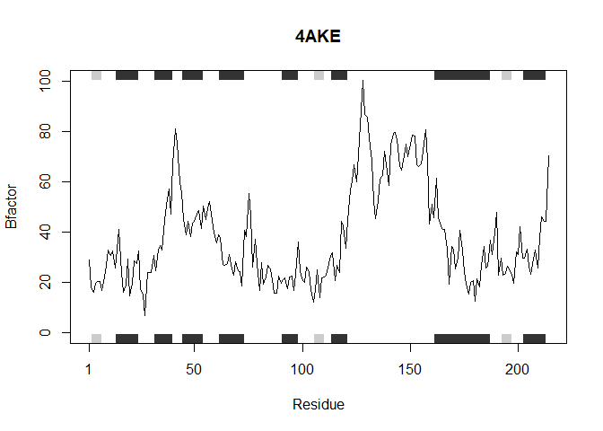
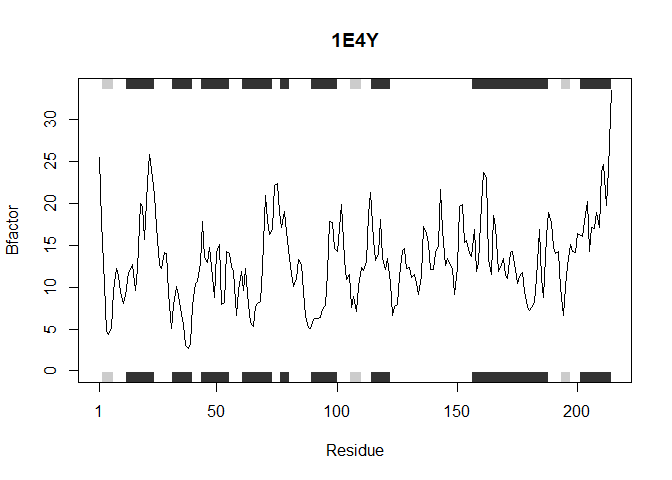

Question 6
================
Amy Prichard
January 25, 2019

``` r
library(bio3d)
```

Original Code:
--------------

``` r
s1 <- read.pdb("4AKE")  # kinase with drug
```

    ##   Note: Accessing on-line PDB file

``` r
s2 <- read.pdb("1AKE")  # kinase no drug
```

    ##   Note: Accessing on-line PDB file
    ##    PDB has ALT records, taking A only, rm.alt=TRUE

``` r
s3 <- read.pdb("1E4Y")  # kinase with drug
```

    ##   Note: Accessing on-line PDB file

``` r
s1.chainA <- trim.pdb(s1, chain="A", elety="CA")
s2.chainA <- trim.pdb(s2, chain="A", elety="CA")
s3.chainA <- trim.pdb(s3, chain="A", elety="CA")

s1.b <- s1.chainA$atom$b
s2.b <- s2.chainA$atom$b
s3.b <- s3.chainA$atom$b

plotb3(s1.b, sse=s1.chainA, typ="l", ylab="Bfactor") 
```


``` r
plotb3(s2.b, sse=s2.chainA, typ="l", ylab="Bfactor") 
```


``` r
plotb3(s3.b, sse=s3.chainA, typ="l", ylab="Bfactor") 
```


"How would you generalize the original code above to work with any set of input protein structures?"
----------------------------------------------------------------------------------------------------

Here is a function that will work for individual PDB codes:

``` r
read_and_plot <- function(pdb_code) {
  ### DOCUMENTATION
  #   INPUT: any valid PDB code
  #   OUTPUT: a line plot showing the B-factor for each alpha-Carbon in the protein that was entered
  #   DESCRIPTION: read_and_plot takes any PDB code as an input and creates a line plot
  #                (using plotb3() from the bio3d library)
  #                of the B-factor for each alpha-Carbon in the protein structure
  ###
  
  PDB_info <- read.pdb(pdb_code)
  # accesses the PDB to load protein information
  
  chainA_alphaCarbons <- trim.pdb(PDB_info, chain="A", elety="CA")
  # selects only alpha-Carbons and makes a list of alpha-Carbon information
  
  alphaCarbon_Bfactor <- chainA_alphaCarbons$atom$b
  # puts the value of the B-factor for each alpha-Carbon into its own vector
  
  plotb3(alphaCarbon_Bfactor, sse=chainA_alphaCarbons, typ="l", ylab="Bfactor", main=pdb_code) 
  # plots the B-factor for the alpha-Carbon of each residue
}
```

``` r
read_and_plot("4AKE")  # kinase with drug
```

    ##   Note: Accessing on-line PDB file

    ## Warning in get.pdb(file, path = tempdir(), verbose = FALSE): C:
    ## \Users\Amy\AppData\Local\Temp\Rtmpmex4Lb/4AKE.pdb exists. Skipping download



``` r
read_and_plot("1AKE")  # kinase no drug
```

    ##   Note: Accessing on-line PDB file

    ## Warning in get.pdb(file, path = tempdir(), verbose = FALSE): C:
    ## \Users\Amy\AppData\Local\Temp\Rtmpmex4Lb/1AKE.pdb exists. Skipping download

    ##    PDB has ALT records, taking A only, rm.alt=TRUE


``` r
read_and_plot("1E4Y")  # kinase with drug
```

    ##   Note: Accessing on-line PDB file

    ## Warning in get.pdb(file, path = tempdir(), verbose = FALSE): C:
    ## \Users\Amy\AppData\Local\Temp\Rtmpmex4Lb/1E4Y.pdb exists. Skipping download



Here is a function that will work for a vector of many PBD codes

``` r
read_and_plot_many <- function(pdb_vector) {
  ### DOCUMENTATION
  #   INPUT: a vector consisting of PDB codes
  #   OUTPUT: line plots showing the B-factor for each alpha-Carbon in the proteins that were entered
  #   DESCRIPTION: read_and_plot takes any PDB codes as input and creates line plots
  #                (using plotb3() from the bio3d library)
  #                of the B-factor for each alpha-Carbon in the protein structures
  ###
  
  for (pdb_code in pdb_vector) {
    PDB_info <- read.pdb(pdb_code)
    # accesses the PDB to load protein information
  
    chainA_alphaCarbons <- trim.pdb(PDB_info, chain="A", elety="CA")
    # selects only alpha-Carbons and makes a list of alpha-Carbon information
  
    alphaCarbon_Bfactor <- chainA_alphaCarbons$atom$b
    # puts the value of the B-factor for each alpha-Carbon into its own vector
  
    plotb3(alphaCarbon_Bfactor, sse=chainA_alphaCarbons, typ="l", ylab="Bfactor", main=pdb_code) 
    # plots the B-factor for the alpha-Carbon of each residue
  }
}
```

``` r
PDB_codes <- c("4AKE", "1AKE", "1E4Y")

read_and_plot_many(PDB_codes)
```

    ##   Note: Accessing on-line PDB file

    ## Warning in get.pdb(file, path = tempdir(), verbose = FALSE): C:
    ## \Users\Amy\AppData\Local\Temp\Rtmpmex4Lb/4AKE.pdb exists. Skipping download

    ##   Note: Accessing on-line PDB file

    ## Warning in get.pdb(file, path = tempdir(), verbose = FALSE): C:
    ## \Users\Amy\AppData\Local\Temp\Rtmpmex4Lb/1AKE.pdb exists. Skipping download


    ##    PDB has ALT records, taking A only, rm.alt=TRUE

    ##   Note: Accessing on-line PDB file

    ## Warning in get.pdb(file, path = tempdir(), verbose = FALSE): C:
    ## \Users\Amy\AppData\Local\Temp\Rtmpmex4Lb/1E4Y.pdb exists. Skipping download


