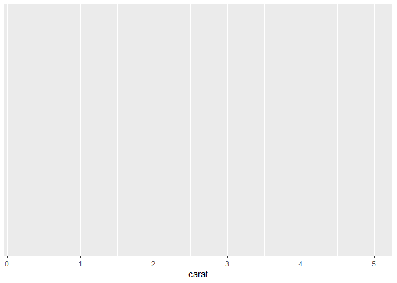
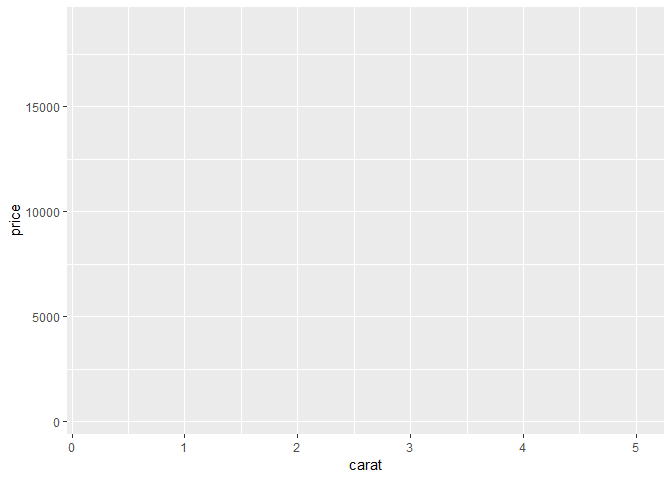
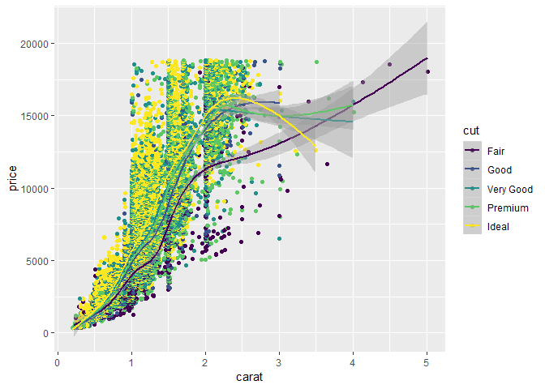
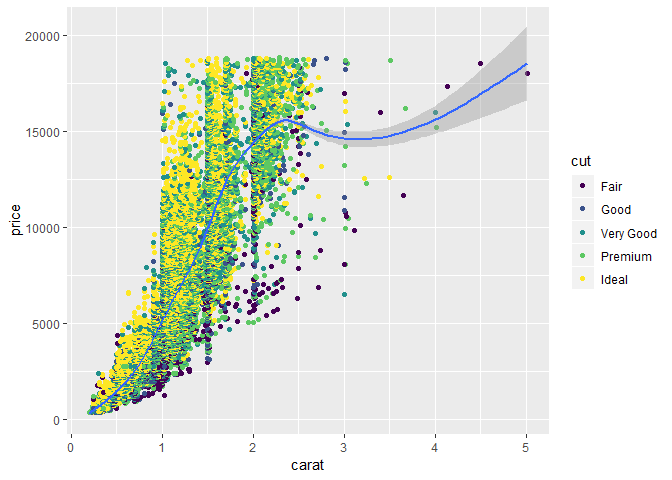

ggplot2 demo
================
Amy Prichard
January 30, 2019

Setup
=====

``` r
# install.packages("ggplot2")
library(ggplot2)
ggplot(diamonds)  # if only the dataset is known.
```


``` r
ggplot(diamonds, aes(x=carat))  # if only X-axis is known. The Y-axis can be specified in respective geoms.
```



``` r
ggplot(diamonds, aes(x=carat, y=price))  # if both X and Y axes are fixed for all layers.
```



``` r
ggplot(diamonds, aes(x=carat, color=cut))  # Each category of the 'cut' variable will now have a distinct  color, once a geom is added.
```


``` r
ggplot(diamonds, aes(x=carat), color="steelblue")
```


``` r
ggplot(diamonds, aes(x=carat, y=price, color=cut)) + geom_point() + geom_smooth() # Adding scatterplot geom (layer1) and smoothing geom (layer2).
```

    ## `geom_smooth()` using method = 'gam' and formula 'y ~ s(x, bs = "cs")'



``` r
ggplot(diamonds) + geom_point(aes(x=carat, y=price, color=cut)) + geom_smooth(aes(x=carat, y=price, color=cut)) # Same as above but specifying the aesthetics inside the geoms.
```

    ## `geom_smooth()` using method = 'gam' and formula 'y ~ s(x, bs = "cs")'


``` r
library(ggplot2)
ggplot(diamonds) + geom_point(aes(x=carat, y=price, color=cut)) + geom_smooth(aes(x=carat, y=price)) # Remove color from geom_smooth
```

    ## `geom_smooth()` using method = 'gam' and formula 'y ~ s(x, bs = "cs")'



``` r
ggplot(diamonds, aes(x=carat, y=price)) + geom_point(aes(color=cut)) + geom_smooth()  # same but simpler
```

    ## `geom_smooth()` using method = 'gam' and formula 'y ~ s(x, bs = "cs")'


