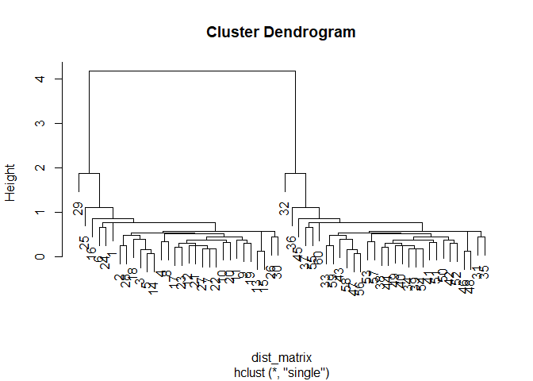
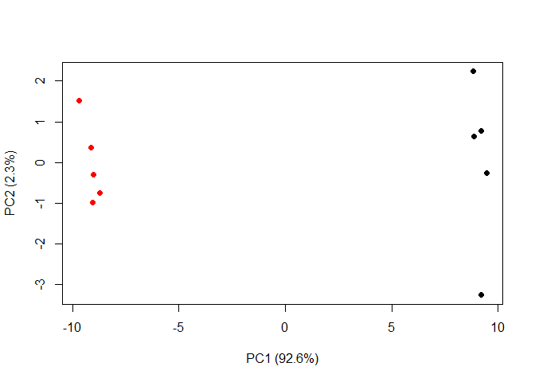
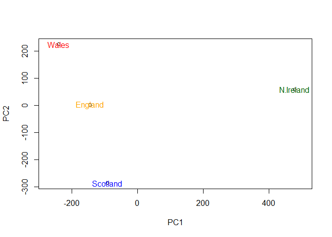

Class 08
================
Amy Prichard
February 6, 2019

Clustering
----------

K-means first play

``` r
tmp <- c(rnorm(30,-3), rnorm(30,3))
x <- cbind(x=tmp, y=rev(tmp))

plot(x)
```


``` r
km <- kmeans(x, 2, nstart=20)
km
```

    ## K-means clustering with 2 clusters of sizes 30, 30
    ## 
    ## Cluster means:
    ##           x         y
    ## 1 -3.214527  2.732320
    ## 2  2.732320 -3.214527
    ## 
    ## Clustering vector:
    ##  [1] 1 1 1 1 1 1 1 1 1 1 1 1 1 1 1 1 1 1 1 1 1 1 1 1 1 1 1 1 1 1 2 2 2 2 2
    ## [36] 2 2 2 2 2 2 2 2 2 2 2 2 2 2 2 2 2 2 2 2 2 2 2 2 2
    ## 
    ## Within cluster sum of squares by cluster:
    ## [1] 49.23804 49.23804
    ##  (between_SS / total_SS =  91.5 %)
    ## 
    ## Available components:
    ## 
    ## [1] "cluster"      "centers"      "totss"        "withinss"    
    ## [5] "tot.withinss" "betweenss"    "size"         "iter"        
    ## [9] "ifault"

Size of clusters

``` r
km$size
```

    ## [1] 30 30

Cluster membership vector

``` r
km$cluster
```

    ##  [1] 1 1 1 1 1 1 1 1 1 1 1 1 1 1 1 1 1 1 1 1 1 1 1 1 1 1 1 1 1 1 2 2 2 2 2
    ## [36] 2 2 2 2 2 2 2 2 2 2 2 2 2 2 2 2 2 2 2 2 2 2 2 2 2

``` r
plot(x, col=km$cluster)
points(km$centers, col="blue", pch=15, cex=3)  # cluster centers (blue squares)
```


``` r
      # cex ("character expansion") changes the size of the point on the plot
```

Hierarchical clustering in R
----------------------------

``` r
# First we need to calculate point (dis)similarity
#   as the Euclidean distance between observations
dist_matrix <- dist(x) 

# The hclust() function returns a hierarchical 
#   clustering model
hc <- hclust(d = dist_matrix)

# the print method is not so useful here
hc  
```

    ## 
    ## Call:
    ## hclust(d = dist_matrix)
    ## 
    ## Cluster method   : complete 
    ## Distance         : euclidean 
    ## Number of objects: 60

``` r
plot(hc)
abline(h=6, col="red")   # marks dendrogram at height=6
```


``` r
grp2 <- cutree(hc, h=6)  # cuts dendrogram at height=6
```

``` r
plot(x, col=grp2)  # shows where the two groups from the dendrogram are
```


``` r
# another example
plot(hc)
abline(h=2.5, col="blue")  # looks like 14 groups
```


``` r
grp14 <- cutree(hc, h=2.5)
table(grp14)
```

    ## grp14
    ##  1  2  3  4  5  6 
    ##  9 11 10 11 10  9

``` r
plot(x, col=grp14)
```


``` r
# ...but I want 6 groups!
grp6 <- cutree(hc, k=6)  # cut into k groups
plot(x, col=grp6)
```


Linkage clusters in hierarchical clustering
-------------------------------------------

COMPLETE: largest possible distance SINGLE: smallest possible distance AVERAGE: mean of all distances CENTROID: distance between centroids

``` r
# Using different hierarchical clustering methods
hc.complete <- hclust(dist_matrix, method="complete")
plot(hc.complete)
```


``` r
hc.average  <- hclust(dist_matrix, method="average")
plot(hc.average)
```


``` r
hc.single   <- hclust(dist_matrix, method="single")
plot(hc.single)
```



``` r
hc.centroid <- hclust(dist_matrix, method="centroid")
plot(hc.centroid)
```


``` r
# Step 1. Generate some example data for clustering
x <- rbind(
  matrix(rnorm(100, mean=0, sd = 0.3), ncol = 2),   # c1
  matrix(rnorm(100, mean = 1, sd = 0.3), ncol = 2), # c2
  matrix(c(rnorm(50, mean = 1, sd = 0.3),           # c3
           rnorm(50, mean = 0, sd = 0.3)), ncol = 2))
colnames(x) <- c("x", "y")
# Step 2. Plot the data without clustering
plot(x)
```


``` r
# Step 3. Generate colors for known clusters 
#         (just so we can compare to hclust results)
col <- as.factor( rep(c("c1","c2","c3"), each=50) ) 
plot(x, col=col)
```


Use the dist(), hclust(), plot() and cutree() functions to return 2 and 3 clusters.
===================================================================================

``` r
hc <- hclust(dist(x))
plot(hc)
abline(h=2.5, col="green")  # 2
x_2 <- cutree(hc, h=2.5)    # 2
abline(h=2, col="magenta")  # 3
```


``` r
x_3 <- cutree(hc, h=2)      # 3

plot(x, col=x_2, main="2")  # 2
```


``` r
plot(x, col=x_3, main="3")  # 3
```


How does this compare to your known 'col' groups?
=================================================

Known 'col' groups is more similar to 3 than to 2. But some changes. Outliers have been grouped into groups that better fit their outlier-ness than their original group (i.e. there are no outliers because they've been grouped away).

``` r
# Example code that does the same thing
hc <- hclust(dist(x))
plot(hc)
```


``` r
grps <- cutree(hc, k=3)  # oh yeah, k is an argument that exists...
plot(x, col=grps)
```


``` r
# This is better anyway (esp. for random data) because it's more precise
```

Principal Component Analysis
----------------------------

``` r
mydata <- read.csv("https://tinyurl.com/expression-CSV", row.names=1) 
head(mydata) 
```

    ##        wt1 wt2  wt3  wt4 wt5 ko1 ko2 ko3 ko4 ko5
    ## gene1  439 458  408  429 420  90  88  86  90  93
    ## gene2  219 200  204  210 187 427 423 434 433 426
    ## gene3 1006 989 1030 1017 973 252 237 238 226 210
    ## gene4  783 792  829  856 760 849 856 835 885 894
    ## gene5  181 249  204  244 225 277 305 272 270 279
    ## gene6  460 502  491  491 493 612 594 577 618 638

``` r
## let's do PCA!
pca <- prcomp(t(mydata), scale=TRUE)
             # transpose mydata so that rows and columns are set up for prcomp()
summary(pca)
```

    ## Importance of components:
    ##                           PC1    PC2     PC3     PC4     PC5     PC6
    ## Standard deviation     9.6237 1.5198 1.05787 1.05203 0.88062 0.82545
    ## Proportion of Variance 0.9262 0.0231 0.01119 0.01107 0.00775 0.00681
    ## Cumulative Proportion  0.9262 0.9493 0.96045 0.97152 0.97928 0.98609
    ##                            PC7     PC8     PC9      PC10
    ## Standard deviation     0.80111 0.62065 0.60342 3.348e-15
    ## Proportion of Variance 0.00642 0.00385 0.00364 0.000e+00
    ## Cumulative Proportion  0.99251 0.99636 1.00000 1.000e+00

Make PCA plot

``` r
plot(pca$x[,1], pca$x[,2], xlab="PC1", ylab="PC2", main="PCA")
```


``` r
    # PC1       # PC2
# PC1, 2, 3, etc are always numbered in order of importance
```

``` r
## Percent variance is often more informative to look at
pca.var <- pca$sdev^2
round(pca.var/sum(pca.var)*100, 1)  # round to one decimal place
```

    ##  [1] 92.6  2.3  1.1  1.1  0.8  0.7  0.6  0.4  0.4  0.0

``` r
pca.var.per <- round(pca.var/sum(pca.var)*100, 1) 
```

``` r
barplot(pca.var.per, main="Scree Plot", xlab="Principal Component", ylab="Percent Variation")
```


Make our PCA plot nice

``` r
## A vector of colors for wt and ko samples 
colvec <- as.factor(substr(colnames(mydata),1,2))

plot(pca$x[,1], pca$x[,2], col=colvec, pch=16,
    xlab=paste0("PC1 (", pca.var.per[1], "%)"),
    ylab=paste0("PC2 (", pca.var.per[2], "%)"))
```



### PCA of UK food data

``` r
x <- read.csv("data/UK_foods.csv")
```

Q1: How many rows and columns are in your new data frame named x? What R functions could you use to answer this question?
=========================================================================================================================

``` r
nrow(x)
```

    ## [1] 17

``` r
ncol(x)
```

    ## [1] 5

``` r
# alternatively...
dim(x)
```

    ## [1] 17  5

Checking your data
------------------

``` r
head(x)
```

    ##                X England Wales Scotland N.Ireland
    ## 1         Cheese     105   103      103        66
    ## 2  Carcass_meat      245   227      242       267
    ## 3    Other_meat      685   803      750       586
    ## 4           Fish     147   160      122        93
    ## 5 Fats_and_oils      193   235      184       209
    ## 6         Sugars     156   175      147       139

``` r
# The row names are incorrectly set as the first column of x
# Fix this by setting row names to the first column, then remove the troublesome first column

rownames(x) <- x[,1]
x <- x[,-1]  # note how the minus indexing works - DON'T RUN THIS TWICE!
head(x)
```

    ##                England Wales Scotland N.Ireland
    ## Cheese             105   103      103        66
    ## Carcass_meat       245   227      242       267
    ## Other_meat         685   803      750       586
    ## Fish               147   160      122        93
    ## Fats_and_oils      193   235      184       209
    ## Sugars             156   175      147       139

``` r
# In the future, fix this by setting row.names=1 in the read.csv() function...
```

``` r
dim(x)
```

    ## [1] 17  4

Q2: Which approach to solving the 'row-names problem' mentioned above do you prefer and why? Is one approach more robust than another under certain circumstances?
==================================================================================================================================================================

``` r
# This is more concise, and it also avoids complications with losing columns!
x <- read.csv("data/UK_foods.csv", row.names=1)
head(x)
```

    ##                England Wales Scotland N.Ireland
    ## Cheese             105   103      103        66
    ## Carcass_meat       245   227      242       267
    ## Other_meat         685   803      750       586
    ## Fish               147   160      122        93
    ## Fats_and_oils      193   235      184       209
    ## Sugars             156   175      147       139

Spotting major differences and trends
-------------------------------------

``` r
barplot(as.matrix(x), beside=T, col=rainbow(nrow(x)))
```


Q3: Changing what optional argument in the above barplot() function results in a plot with stacked bars?
========================================================================================================

``` r
barplot(as.matrix(x), beside=F, col=rainbow(nrow(x)))  # beside=FALSE
```


There is no Q4...
=================

Q5: Generating all pairwise plots may help somewhat. Can you make sense of the following code and resulting figure? What does it mean if a given point lies on the diagonal for a given plot?
=============================================================================================================================================================================================

``` r
pairs(x, col=rainbow(10), pch=16)
```


``` r
# Word boxes show axis titles
# On the diagonal = no difference between two groups
```

Q6: What is the main differences between Northern Ireland and the other countries of the UK in terms of this data-set?
======================================================================================================================

I don't know... let's try PCA!

PCA to the rescue
-----------------

``` r
# Use the prcomp() PCA function 
pca <- prcomp(t(x))
summary(pca)
```

    ## Importance of components:
    ##                             PC1      PC2      PC3       PC4
    ## Standard deviation     324.1502 212.7478 73.87622 4.189e-14
    ## Proportion of Variance   0.6744   0.2905  0.03503 0.000e+00
    ## Cumulative Proportion    0.6744   0.9650  1.00000 1.000e+00

Q7: Complete the code below to generate a plot of PC1 vs PC2. The second line adds text labels over the data points.
====================================================================================================================

``` r
# Plot PC1 vs PC2
plot(pca$x[,1], pca$x[,2], xlab="PC1", ylab="PC2", xlim=c(-270,500))
text(pca$x[,1], pca$x[,2], colnames(x))
```


Q8: Customize your plot so that the colors of the country names match the colors in our UK and Ireland map and table at the start of this document.
===================================================================================================================================================

``` r
plot(pca$x[,1], pca$x[,2], xlab="PC1", ylab="PC2", xlim=c(-270,500))

CountryColors <- c("orange", "red", "blue", "darkgreen")

text(pca$x[,1], pca$x[,2], colnames(x), col=CountryColors)
```



``` r
v <- round( pca$sdev^2/sum(pca$sdev^2) * 100 )
v
```

    ## [1] 67 29  4  0

``` r
## or the second row here...
z <- summary(pca)
z$importance
```

    ##                              PC1       PC2      PC3          PC4
    ## Standard deviation     324.15019 212.74780 73.87622 4.188568e-14
    ## Proportion of Variance   0.67444   0.29052  0.03503 0.000000e+00
    ## Cumulative Proportion    0.67444   0.96497  1.00000 1.000000e+00

``` r
barplot(v, xlab="Principal Component", ylab="Percent Variation")
```


Digging deeper (variable loadings)
----------------------------------

``` r
## Let's focus on PC1 as it accounts for > 90% of variance 
par(mar=c(10, 3, 0.35, 0))
barplot( pca$rotation[,1], las=2 )
```


Q9: Generate a similar 'loadings plot' for PC2. What two food groups feature prominately and what does PC2 mainly tell us about?
================================================================================================================================

Fresh potatoes is highest upward change, fresh fruit is highest downward change

Biplots
-------

``` r
## The inbuilt biplot() can be useful for small datasets 
biplot(pca)
```


