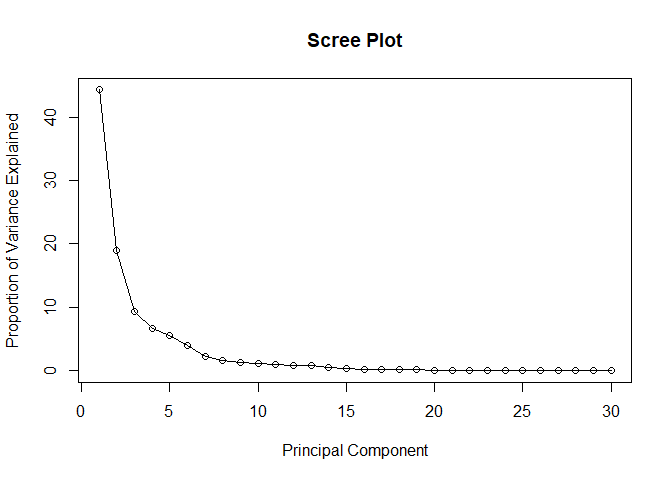
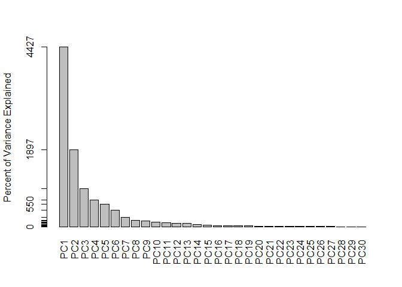
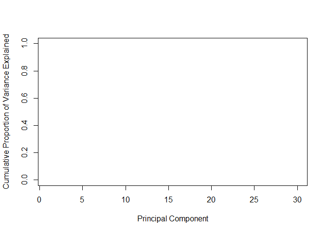
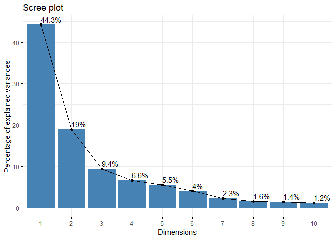
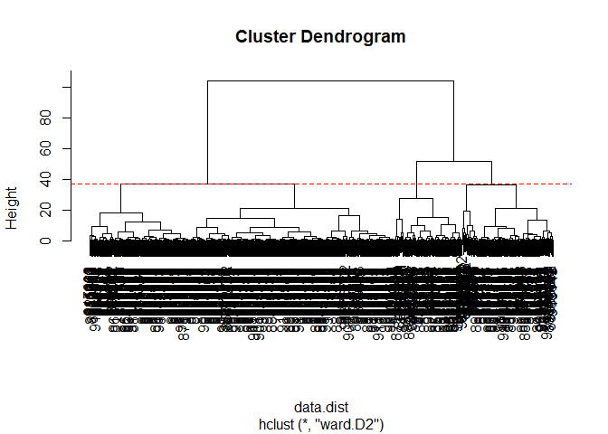
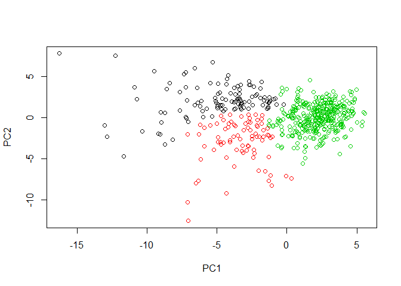
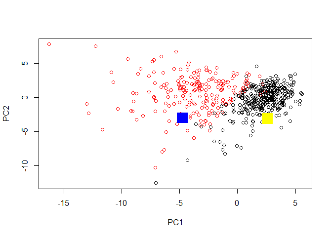

Class 09
================
Amy Prichard
February 8, 2019

Unsupervised Learning Analysis of Human Breast Cancer Cells
===========================================================

1. Exploratory Data Analysis
----------------------------

``` r
# Save your input data file to a new 'data' directory
fna.data <- "data/WisconsinCancer.csv"

# Complete the following code to input the data and store as wisc.df
wisc.df <- read.csv(fna.data)

head(wisc.df)
```

    ##         id diagnosis radius_mean texture_mean perimeter_mean area_mean
    ## 1   842302         M       17.99        10.38         122.80    1001.0
    ## 2   842517         M       20.57        17.77         132.90    1326.0
    ## 3 84300903         M       19.69        21.25         130.00    1203.0
    ## 4 84348301         M       11.42        20.38          77.58     386.1
    ## 5 84358402         M       20.29        14.34         135.10    1297.0
    ## 6   843786         M       12.45        15.70          82.57     477.1
    ##   smoothness_mean compactness_mean concavity_mean concave.points_mean
    ## 1         0.11840          0.27760         0.3001             0.14710
    ## 2         0.08474          0.07864         0.0869             0.07017
    ## 3         0.10960          0.15990         0.1974             0.12790
    ## 4         0.14250          0.28390         0.2414             0.10520
    ## 5         0.10030          0.13280         0.1980             0.10430
    ## 6         0.12780          0.17000         0.1578             0.08089
    ##   symmetry_mean fractal_dimension_mean radius_se texture_se perimeter_se
    ## 1        0.2419                0.07871    1.0950     0.9053        8.589
    ## 2        0.1812                0.05667    0.5435     0.7339        3.398
    ## 3        0.2069                0.05999    0.7456     0.7869        4.585
    ## 4        0.2597                0.09744    0.4956     1.1560        3.445
    ## 5        0.1809                0.05883    0.7572     0.7813        5.438
    ## 6        0.2087                0.07613    0.3345     0.8902        2.217
    ##   area_se smoothness_se compactness_se concavity_se concave.points_se
    ## 1  153.40      0.006399        0.04904      0.05373           0.01587
    ## 2   74.08      0.005225        0.01308      0.01860           0.01340
    ## 3   94.03      0.006150        0.04006      0.03832           0.02058
    ## 4   27.23      0.009110        0.07458      0.05661           0.01867
    ## 5   94.44      0.011490        0.02461      0.05688           0.01885
    ## 6   27.19      0.007510        0.03345      0.03672           0.01137
    ##   symmetry_se fractal_dimension_se radius_worst texture_worst
    ## 1     0.03003             0.006193        25.38         17.33
    ## 2     0.01389             0.003532        24.99         23.41
    ## 3     0.02250             0.004571        23.57         25.53
    ## 4     0.05963             0.009208        14.91         26.50
    ## 5     0.01756             0.005115        22.54         16.67
    ## 6     0.02165             0.005082        15.47         23.75
    ##   perimeter_worst area_worst smoothness_worst compactness_worst
    ## 1          184.60     2019.0           0.1622            0.6656
    ## 2          158.80     1956.0           0.1238            0.1866
    ## 3          152.50     1709.0           0.1444            0.4245
    ## 4           98.87      567.7           0.2098            0.8663
    ## 5          152.20     1575.0           0.1374            0.2050
    ## 6          103.40      741.6           0.1791            0.5249
    ##   concavity_worst concave.points_worst symmetry_worst
    ## 1          0.7119               0.2654         0.4601
    ## 2          0.2416               0.1860         0.2750
    ## 3          0.4504               0.2430         0.3613
    ## 4          0.6869               0.2575         0.6638
    ## 5          0.4000               0.1625         0.2364
    ## 6          0.5355               0.1741         0.3985
    ##   fractal_dimension_worst  X
    ## 1                 0.11890 NA
    ## 2                 0.08902 NA
    ## 3                 0.08758 NA
    ## 4                 0.17300 NA
    ## 5                 0.07678 NA
    ## 6                 0.12440 NA

``` r
# looks like there is a funny last column called "X" --> need to get rid of it
```

Let's take columns 3-32 for further analysis (i.e. get rid of patient ID, diagnosis, and "column X" so they don't clog up the data)

``` r
# Convert the features of the data: wisc.data
wisc.data <- as.matrix(wisc.df[,3:32])
```

...but we want to keep patient ID as ROW NAMES!

``` r
# Set the row names of wisc.data
rownames(wisc.data) <- wisc.df$id

head(wisc.data)
```

    ##          radius_mean texture_mean perimeter_mean area_mean smoothness_mean
    ## 842302         17.99        10.38         122.80    1001.0         0.11840
    ## 842517         20.57        17.77         132.90    1326.0         0.08474
    ## 84300903       19.69        21.25         130.00    1203.0         0.10960
    ## 84348301       11.42        20.38          77.58     386.1         0.14250
    ## 84358402       20.29        14.34         135.10    1297.0         0.10030
    ## 843786         12.45        15.70          82.57     477.1         0.12780
    ##          compactness_mean concavity_mean concave.points_mean symmetry_mean
    ## 842302            0.27760         0.3001             0.14710        0.2419
    ## 842517            0.07864         0.0869             0.07017        0.1812
    ## 84300903          0.15990         0.1974             0.12790        0.2069
    ## 84348301          0.28390         0.2414             0.10520        0.2597
    ## 84358402          0.13280         0.1980             0.10430        0.1809
    ## 843786            0.17000         0.1578             0.08089        0.2087
    ##          fractal_dimension_mean radius_se texture_se perimeter_se area_se
    ## 842302                  0.07871    1.0950     0.9053        8.589  153.40
    ## 842517                  0.05667    0.5435     0.7339        3.398   74.08
    ## 84300903                0.05999    0.7456     0.7869        4.585   94.03
    ## 84348301                0.09744    0.4956     1.1560        3.445   27.23
    ## 84358402                0.05883    0.7572     0.7813        5.438   94.44
    ## 843786                  0.07613    0.3345     0.8902        2.217   27.19
    ##          smoothness_se compactness_se concavity_se concave.points_se
    ## 842302        0.006399        0.04904      0.05373           0.01587
    ## 842517        0.005225        0.01308      0.01860           0.01340
    ## 84300903      0.006150        0.04006      0.03832           0.02058
    ## 84348301      0.009110        0.07458      0.05661           0.01867
    ## 84358402      0.011490        0.02461      0.05688           0.01885
    ## 843786        0.007510        0.03345      0.03672           0.01137
    ##          symmetry_se fractal_dimension_se radius_worst texture_worst
    ## 842302       0.03003             0.006193        25.38         17.33
    ## 842517       0.01389             0.003532        24.99         23.41
    ## 84300903     0.02250             0.004571        23.57         25.53
    ## 84348301     0.05963             0.009208        14.91         26.50
    ## 84358402     0.01756             0.005115        22.54         16.67
    ## 843786       0.02165             0.005082        15.47         23.75
    ##          perimeter_worst area_worst smoothness_worst compactness_worst
    ## 842302            184.60     2019.0           0.1622            0.6656
    ## 842517            158.80     1956.0           0.1238            0.1866
    ## 84300903          152.50     1709.0           0.1444            0.4245
    ## 84348301           98.87      567.7           0.2098            0.8663
    ## 84358402          152.20     1575.0           0.1374            0.2050
    ## 843786            103.40      741.6           0.1791            0.5249
    ##          concavity_worst concave.points_worst symmetry_worst
    ## 842302            0.7119               0.2654         0.4601
    ## 842517            0.2416               0.1860         0.2750
    ## 84300903          0.4504               0.2430         0.3613
    ## 84348301          0.6869               0.2575         0.6638
    ## 84358402          0.4000               0.1625         0.2364
    ## 843786            0.5355               0.1741         0.3985
    ##          fractal_dimension_worst
    ## 842302                   0.11890
    ## 842517                   0.08902
    ## 84300903                 0.08758
    ## 84348301                 0.17300
    ## 84358402                 0.07678
    ## 843786                   0.12440

...and we want to keep the diagnoses as INDECES!

``` r
# Create diagnosis vector by completing the missing code
diagnosis <- as.numeric(wisc.df$diagnosis=="M")
```

### Q1. How many observations are in this dataset?

``` r
# Check how many patients
nrow(wisc.data)  # 569
```

    ## [1] 569

``` r
# Check how many features tested
ncol(wisc.data)  #  33
```

    ## [1] 30

### Q2. How many variables/features in he data are suffixed with "\_mean"?

``` r
# Regular Expressions... or not.
# grep() finds indeces that match some pattern
# in this case, the pattern is "_mean" but it could also be a regular expression
# fixed=TRUE means the pattern must be a string that should be matched sa is
# fixed=FALSE is the default... I imagine it allows regular expressions?
length(grep("_mean", colnames(wisc.data), fixed=TRUE))  # fixed=TRUE seems optional?
```

    ## [1] 10

``` r
# Python/R version
# meancounter = 0
# for item in colnames(wisc.data):
#     if "_mean" in item:
#         meancounter+=1
# print(meancounter)
```

### Q3. How many of the observations have a malignant diagnosis?

``` r
table(wisc.df$diagnosis)
```

    ## 
    ##   B   M 
    ## 357 212

Principal Component Analysis
----------------------------

``` r
apply(wisc.data, 2, mean)  # 2 indicates columns (1 indicates rows)
```

    ##             radius_mean            texture_mean          perimeter_mean 
    ##            1.412729e+01            1.928965e+01            9.196903e+01 
    ##               area_mean         smoothness_mean        compactness_mean 
    ##            6.548891e+02            9.636028e-02            1.043410e-01 
    ##          concavity_mean     concave.points_mean           symmetry_mean 
    ##            8.879932e-02            4.891915e-02            1.811619e-01 
    ##  fractal_dimension_mean               radius_se              texture_se 
    ##            6.279761e-02            4.051721e-01            1.216853e+00 
    ##            perimeter_se                 area_se           smoothness_se 
    ##            2.866059e+00            4.033708e+01            7.040979e-03 
    ##          compactness_se            concavity_se       concave.points_se 
    ##            2.547814e-02            3.189372e-02            1.179614e-02 
    ##             symmetry_se    fractal_dimension_se            radius_worst 
    ##            2.054230e-02            3.794904e-03            1.626919e+01 
    ##           texture_worst         perimeter_worst              area_worst 
    ##            2.567722e+01            1.072612e+02            8.805831e+02 
    ##        smoothness_worst       compactness_worst         concavity_worst 
    ##            1.323686e-01            2.542650e-01            2.721885e-01 
    ##    concave.points_worst          symmetry_worst fractal_dimension_worst 
    ##            1.146062e-01            2.900756e-01            8.394582e-02

``` r
round(colMeans(wisc.data), 2)  # another way to do it
```

    ##             radius_mean            texture_mean          perimeter_mean 
    ##                   14.13                   19.29                   91.97 
    ##               area_mean         smoothness_mean        compactness_mean 
    ##                  654.89                    0.10                    0.10 
    ##          concavity_mean     concave.points_mean           symmetry_mean 
    ##                    0.09                    0.05                    0.18 
    ##  fractal_dimension_mean               radius_se              texture_se 
    ##                    0.06                    0.41                    1.22 
    ##            perimeter_se                 area_se           smoothness_se 
    ##                    2.87                   40.34                    0.01 
    ##          compactness_se            concavity_se       concave.points_se 
    ##                    0.03                    0.03                    0.01 
    ##             symmetry_se    fractal_dimension_se            radius_worst 
    ##                    0.02                    0.00                   16.27 
    ##           texture_worst         perimeter_worst              area_worst 
    ##                   25.68                  107.26                  880.58 
    ##        smoothness_worst       compactness_worst         concavity_worst 
    ##                    0.13                    0.25                    0.27 
    ##    concave.points_worst          symmetry_worst fractal_dimension_worst 
    ##                    0.11                    0.29                    0.08

``` r
# what about standard deviation?
round(apply(wisc.data,2,sd), 2)
```

    ##             radius_mean            texture_mean          perimeter_mean 
    ##                    3.52                    4.30                   24.30 
    ##               area_mean         smoothness_mean        compactness_mean 
    ##                  351.91                    0.01                    0.05 
    ##          concavity_mean     concave.points_mean           symmetry_mean 
    ##                    0.08                    0.04                    0.03 
    ##  fractal_dimension_mean               radius_se              texture_se 
    ##                    0.01                    0.28                    0.55 
    ##            perimeter_se                 area_se           smoothness_se 
    ##                    2.02                   45.49                    0.00 
    ##          compactness_se            concavity_se       concave.points_se 
    ##                    0.02                    0.03                    0.01 
    ##             symmetry_se    fractal_dimension_se            radius_worst 
    ##                    0.01                    0.00                    4.83 
    ##           texture_worst         perimeter_worst              area_worst 
    ##                    6.15                   33.60                  569.36 
    ##        smoothness_worst       compactness_worst         concavity_worst 
    ##                    0.02                    0.16                    0.21 
    ##    concave.points_worst          symmetry_worst fractal_dimension_worst 
    ##                    0.07                    0.06                    0.02

``` r
# Perform PCA on wisc.data by completing the following code
wisc.pr <- prcomp(wisc.data, scale=TRUE)

# Look at summary of results
summary(wisc.pr)
```

    ## Importance of components:
    ##                           PC1    PC2     PC3     PC4     PC5     PC6
    ## Standard deviation     3.6444 2.3857 1.67867 1.40735 1.28403 1.09880
    ## Proportion of Variance 0.4427 0.1897 0.09393 0.06602 0.05496 0.04025
    ## Cumulative Proportion  0.4427 0.6324 0.72636 0.79239 0.84734 0.88759
    ##                            PC7     PC8    PC9    PC10   PC11    PC12
    ## Standard deviation     0.82172 0.69037 0.6457 0.59219 0.5421 0.51104
    ## Proportion of Variance 0.02251 0.01589 0.0139 0.01169 0.0098 0.00871
    ## Cumulative Proportion  0.91010 0.92598 0.9399 0.95157 0.9614 0.97007
    ##                           PC13    PC14    PC15    PC16    PC17    PC18
    ## Standard deviation     0.49128 0.39624 0.30681 0.28260 0.24372 0.22939
    ## Proportion of Variance 0.00805 0.00523 0.00314 0.00266 0.00198 0.00175
    ## Cumulative Proportion  0.97812 0.98335 0.98649 0.98915 0.99113 0.99288
    ##                           PC19    PC20   PC21    PC22    PC23   PC24
    ## Standard deviation     0.22244 0.17652 0.1731 0.16565 0.15602 0.1344
    ## Proportion of Variance 0.00165 0.00104 0.0010 0.00091 0.00081 0.0006
    ## Cumulative Proportion  0.99453 0.99557 0.9966 0.99749 0.99830 0.9989
    ##                           PC25    PC26    PC27    PC28    PC29    PC30
    ## Standard deviation     0.12442 0.09043 0.08307 0.03987 0.02736 0.01153
    ## Proportion of Variance 0.00052 0.00027 0.00023 0.00005 0.00002 0.00000
    ## Cumulative Proportion  0.99942 0.99969 0.99992 0.99997 1.00000 1.00000

### Q4. From your results, what proportion of the original variance is captured by the first principal components (PC1)?

44.27%

### Q5. How many principal components (PCs) are required to describe at least 70% of the original variance in the data?

Three

### Q6. How many principal components (PCs) are required to describe at least 90% of the original variance in the data?

Seven

``` r
biplot(wisc.pr)
```


### Q7. What stands out to you about this plot? Is it easy or difficult to understand? Why?

"That is a useless plot!"

``` r
# Scatter plot observations by components 1 and 2
plot(wisc.pr$x[,1], wisc.pr$x[,2], col=wisc.df$diagnosis, xlab="PC1", ylab="PC2")
```


### Q8. Generate a similar plot for principal components 1 and 3. What do you notice about these plots?

``` r
# Repeat for components 1 and 3
plot(wisc.pr$x[,1], wisc.pr$x[,3], col=wisc.df$diagnosis, xlab="PC1", ylab="PC3")
```

 The two graphs look pretty similar, but the PC1 vs PC3 graph is shifted a bit downward relative to the PC1 vs PC2 graph.

``` r
# Making a scree plot...

# calculate variance
prvar <- wisc.pr$sdev^2

# calculate the variance explained by each prinicpal component
pve <- round((prvar/sum(prvar))*100, 2)

# plot it!
plot(pve, type="o", xlab="Principal Component", ylab="Proportion of Variance Explained", main="Scree Plot")
```



Fancy barplot

``` r
barplot(pve, ylab = "Percent of Variance Explained", names.arg=paste0("PC",1:length(pve)), las=2, axes = FALSE)
# names.arg=paste0("PC",1:length(pve)) labels the bars on the barplot
          # paste0() sets sep="" to get rid of whitespace
# las=2 makes the axis labels perpendicular (see graphical parameters)
# axes=FALSE gets rid of existing axes
axis(2, at=pve, labels=round(pve,2)*100 )
```



``` r
# this puts a custom axis on the graph
# at=pve puts the ticks where the values are
# labels=round(pve,2)*100 rounds the tick labels
```

``` r
# Plot cumulative proportion of variance explained
plot(cumsum(pve), xlab = "Principal Component", ylab = "Cumulative Proportion of Variance Explained", ylim = c(0, 1), type = "o")
```



``` r
# not sure why this is blank
```

``` r
## ggplot based graph
# install.packages("factoextra")
library(factoextra)
```

    ## Loading required package: ggplot2

    ## Welcome! Related Books: `Practical Guide To Cluster Analysis in R` at https://goo.gl/13EFCZ

``` r
fviz_eig(wisc.pr, addlabels = TRUE)
```



### Q9. For the first principal component, what is the component of the loading vector (i.e. wisc.pr$rotation\[,1\]) for the feature concave.points\_mean?

### Q10. What is the minimum number of principal components required to explain 80% of the variance of the data?

Hierarchical Clustering
-----------------------

``` r
# Scale the wisc.data data: data.scaled
data.scaled <- prcomp(wisc.data, scale=TRUE)

data.dist <- dist(wisc.pr$x[,1:2])

wisc.hclust <- hclust(data.dist, method="ward.D2")
```

### Q11. Using the plot() and abline() functions, what is the height at which the clustering model has 4 clusters?

``` r
plot(wisc.hclust)
abline(h=36.7, col="red", lty=2)
```



``` r
wisc.hclust.clusters <- cutree(wisc.hclust, h=36.7)
table(wisc.hclust.clusters, diagnosis)  # cross tabulation
```

    ##                     diagnosis
    ## wisc.hclust.clusters   0   1
    ##                    1   0 112
    ##                    2  18  65
    ##                    3 232  18
    ##                    4 107  17

### Q12. Can you find a better cluster vs diagnoses match with by cutting into a different number of clusters between 2 and 10?

``` r
table(cutree(wisc.hclust, k=2), diagnosis)  # makes logical sense because Malignant vs Benign tumors
```

    ##    diagnosis
    ##       0   1
    ##   1  18 177
    ##   2 339  35

We want 3 groups...

``` r
grp3 <- cutree(wisc.hclust, k=3)
table(grp3)
```

    ## grp3
    ##   1   2   3 
    ## 112  83 374

``` r
plot(wisc.pr$x[,1], wisc.pr$x[,2], xlab="PC1", ylab="PC2", col=grp3)
```



Cross tabulation of the 3 groups

``` r
table(grp3, wisc.df$diagnosis)
```

    ##     
    ## grp3   B   M
    ##    1   0 112
    ##    2  18  65
    ##    3 339  35

K-means Clustering
------------------

``` r
wisc.km <- kmeans(wisc.data, centers=2, nstart=20)
```

``` r
table(wisc.km$cluster, diagnosis)
```

    ##    diagnosis
    ##       0   1
    ##   1   1 130
    ##   2 356  82

### Q13. How well does k-means separate the two diagnoses? How does it compare to your hclust results?

This seems better than hclust... but probably not perfect

``` r
table(wisc.hclust.clusters, wisc.km$cluster)
```

    ##                     
    ## wisc.hclust.clusters   1   2
    ##                    1 108   4
    ##                    2  17  66
    ##                    3   6 244
    ##                    4   0 124

Combining methods
-----------------

Sensitivity/Specificity
-----------------------

<sub>~</sub>
============

Prediction
----------

``` r
#url <- "new_samples.csv"
url <- "https://tinyurl.com/new-samples-CSV"
new <- read.csv(url)
npc <- predict(wisc.pr, newdata=new)
npc
```

    ##            PC1       PC2        PC3        PC4       PC5        PC6
    ## [1,]  2.576616 -3.135913  1.3990492 -0.7631950  2.781648 -0.8150185
    ## [2,] -4.754928 -3.009033 -0.1660946 -0.6052952 -1.140698 -1.2189945
    ##             PC7        PC8       PC9       PC10      PC11      PC12
    ## [1,] -0.3959098 -0.2307350 0.1029569 -0.9272861 0.3411457  0.375921
    ## [2,]  0.8193031 -0.3307423 0.5281896 -0.4855301 0.7173233 -1.185917
    ##           PC13     PC14      PC15       PC16        PC17        PC18
    ## [1,] 0.1610764 1.187882 0.3216974 -0.1743616 -0.07875393 -0.11207028
    ## [2,] 0.5893856 0.303029 0.1299153  0.1448061 -0.40509706  0.06565549
    ##             PC19       PC20       PC21       PC22       PC23       PC24
    ## [1,] -0.08802955 -0.2495216  0.1228233 0.09358453 0.08347651  0.1223396
    ## [2,]  0.25591230 -0.4289500 -0.1224776 0.01732146 0.06316631 -0.2338618
    ##             PC25         PC26         PC27        PC28         PC29
    ## [1,]  0.02124121  0.078884581  0.220199544 -0.02946023 -0.015620933
    ## [2,] -0.20755948 -0.009833238 -0.001134152  0.09638361  0.002795349
    ##              PC30
    ## [1,]  0.005269029
    ## [2,] -0.019015820

``` r
plot(wisc.pr$x[,1:2], col=wisc.df$diagnosis)
points(npc[,1], npc[,2], col=c("yellow","blue"), pch=15, cex=3)
```



### Q17. Which of these new patients should we prioritize for follow up based on your results?

The blue one (patient \#2)
