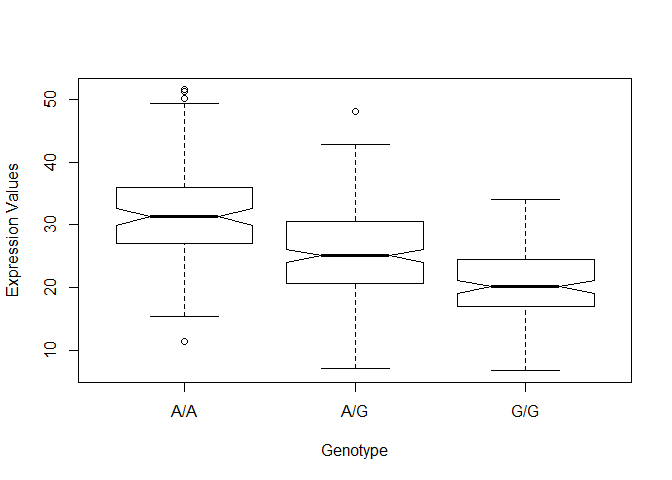
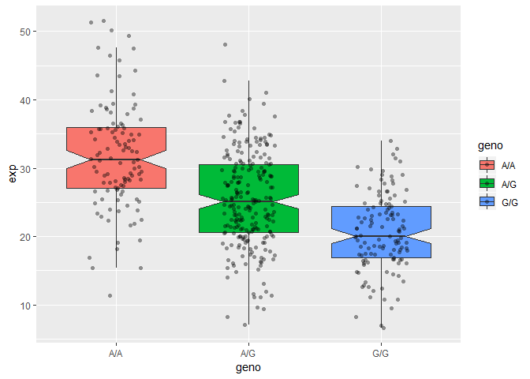

Class 13
================
Amy Prichard
02/22/2019

Section 1
---------

``` r
genotypes <- "373531-SampleGenotypes-Homo_sapiens_Variation_Sample_rs8067378.csv"
genotable <- read.csv(genotypes)

genoGG <- genotable$Genotype..forward.strand. == "G|G"

GGtot <- sum(genoGG)
GGper <- GGtot/nrow(genotable)

print(GGtot)
```

    ## [1] 9

``` r
print(GGper)
```

    ## [1] 0.140625

``` r
#alternative method to find total
table(genotable$Genotype..forward.strand.)
```

    ## 
    ## A|A A|G G|A G|G 
    ##  22  21  12   9

Section 2
---------

``` r
#install.packages("seqinr")
#install.packages("gtools")

library(seqinr)
library(gtools)

phred <- asc( s2c("DDDDCDEDCDDDDBBDDDCC@") ) - 33
phred
```

    ##  D  D  D  D  C  D  E  D  C  D  D  D  D  B  B  D  D  D  C  C  @ 
    ## 35 35 35 35 34 35 36 35 34 35 35 35 35 33 33 35 35 35 34 34 31

``` r
prob <- 10**(-phred/10)
```

Section 4
---------

``` r
infile <- "rs8067378_ENSG00000172057.6.txt"
expr <- read.table(infile, header=TRUE)
head(expr)
```

    ##    sample geno      exp
    ## 1 HG00367  A/G 28.96038
    ## 2 NA20768  A/G 20.24449
    ## 3 HG00361  A/A 31.32628
    ## 4 HG00135  A/A 34.11169
    ## 5 NA18870  G/G 18.25141
    ## 6 NA11993  A/A 32.89721

``` r
table(expr$geno)  # G/A and A/G are combined
```

    ## 
    ## A/A A/G G/G 
    ## 108 233 121

``` r
# median expression

GGindex <- expr$geno == "G/G"
summary(expr$exp[GGindex])
```

    ##    Min. 1st Qu.  Median    Mean 3rd Qu.    Max. 
    ##   6.675  16.903  20.074  20.594  24.457  33.956

``` r
AGindex <- expr$geno == "A/G"
summary(expr$exp[AGindex])
```

    ##    Min. 1st Qu.  Median    Mean 3rd Qu.    Max. 
    ##   7.075  20.626  25.065  25.397  30.552  48.034

``` r
AAindex <- expr$geno == "A/A"
summary(expr$exp[AAindex])
```

    ##    Min. 1st Qu.  Median    Mean 3rd Qu.    Max. 
    ##   11.40   27.02   31.25   31.82   35.92   51.52

``` r
# plotting
boxplot(exp ~ geno, data=expr, ylab="Expression Values", xlab="Genotype", notch=TRUE)  # notch=TRUE gives the boxes that weird shape... not sure why you would want this, but apparently it's kind of cool
```



``` r
library(ggplot2)

# Boxplot with the data shown
ggplot(expr, aes(geno, exp, fill=geno)) + 
  geom_boxplot(notch=TRUE, outlier.shape = NA) + 
  geom_jitter(shape=16, position=position_jitter(0.2), alpha=0.4)
```


