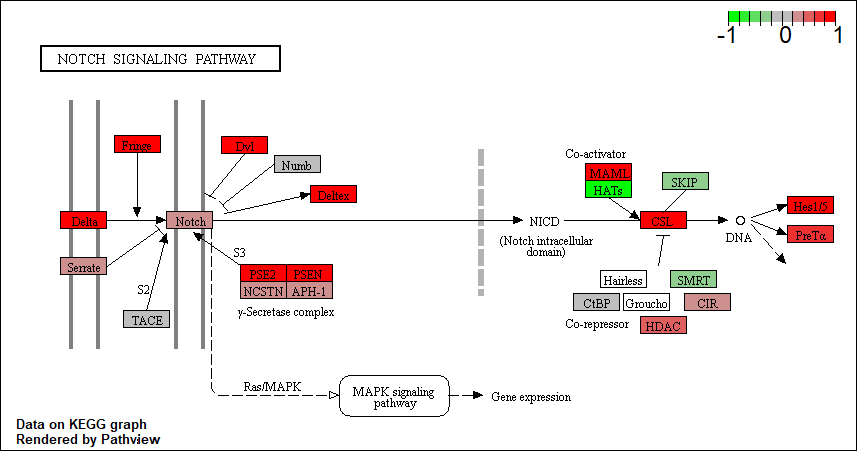

```{r setup, include=FALSE}
knitr::opts_chunk$set(echo = TRUE)
```

# Section 1. Differential Expression Analysis

```{r message=FALSE}
# message=FALSE means random messages from stuff like loading packages doesn't show up in a knitted report
library(DESeq2)
```

Load our data files
```{r}
metaFile <- "data/GSE37704_metadata.csv"
countFile <- "data/GSE37704_featurecounts.csv"

# Import metadata
colData = read.csv(metaFile, row.names=1)
head(colData)

# Import countdata
countData = read.csv(countFile, row.names=1)
head(countData)
```

We need the countData and colData files to match up so we will need to remove countData$length

```{r}
dim(countData)
```


### Q1: remove the troublesome first column from countData
```{r}
countData <- as.matrix(countData[,-1])
head(countData)
dim(countData)
```

```{r}
all(rownames(colData) == colnames(countData))
```

### Q2: filter countData to exclude genes (i.e. rows) where we have 0 read count across all samples (i.e. columns).
#### Tip: What will rowSums() of countData return, and how could you use it in this context?
```{r}
nonzero <- rowSums(countData) != 0
countData = countData[nonzero,]
head(countData)

# alternate version:
# zeros <- rowSums(countData) == 0
# countData = countData[!zeros,]
```

#### How many genes do we have left?
```{r}
nrow(countData)
```
We now have `r nrow(countData)` genes remaining in our dataset.

## Running DESeq2

```{r}
dds = DESeqDataSetFromMatrix(countData=countData,
                             colData=colData,
                             design=~condition)
dds = DESeq(dds)
```

```{r}
res <- results(dds)
head(res)
```

### Q3: Call the summary() function on your results to get a sense of how many genes are up or down-regulated at the default 0.1 p-value cutoff.

```{r}
summary(res)
```

## Volcano Plot

```{r}
plot(res$log2FoldChange, -log(res$padj))
```

### Q4: Improve this plot by adding color and axis labels
```{r}
# Make a color vector for all genes
mycols <- rep("gray", nrow(res))  # background gray

# Color red the genes with absolute fold change above 2
mycols[abs(res$log2FoldChange)>2] <- "red"  # high fold change red

# Color blue those with adjusted p-value less than 0.01 and absolute fold change more than 2
mycols[(res$padj<0.01) & (abs(res$log2FoldChange)>2)] <- "blue" # high fold change and statistically significant blue

# plot
plot(res$log2FoldChange, -log(res$padj), col=mycols, xlab="log2(FoldChange)", ylab="-log(P-value)")
```

## Adding gene annotation

### Q5. Use the mapIDs() function multiple times to add SYMBOL, ENTREZID and GENENAME annotation to our results by completing the code below.
```{r message=FALSE}
library("AnnotationDbi")
library("org.Hs.eg.db")
```
```{r}
columns(org.Hs.eg.db)

res$symbol = mapIds(org.Hs.eg.db,
                    keys=row.names(res), 
                    keytype="ENSEMBL",
                    column="SYMBOL",
                    multiVals="first")

res$entrez = mapIds(org.Hs.eg.db,
                    keys=row.names(res),
                    keytype="ENSEMBL",
                    column="ENTREZID",
                    multiVals="first")

res$name =   mapIds(org.Hs.eg.db,
                    keys=row.names(res),
                    keytype="ENSEMBL",
                    column="GENENAME",
                    multiVals="first")

head(res,10)
```

### Q6. reorder these results by adjusted p-value and save them to a CSV file in your current project directory.
```{r}
res = res[order(res$pvalue),]
write.csv(res, file="deseq_results.csv")
```

# Section 2. Pathway Analysis

Here we are going to use the **gage** package for pathway analysis. Once we have a list of enriched pathways, we’re going to use the **pathview** package to draw pathway diagrams, shading the molecules in the pathway by their degree of up/down-regulation.

## KEGG pathways

```{r,  eval=FALSE}
source("http://bioconductor.org/biocLite.R")
biocLite(c("pathview", "gage", "gageData"))
```

```{r}
library(pathview)
```

```{r message=FALSE}
library(gage)
library(gageData)
```

```{r}
data(kegg.sets.hs)
data(sigmet.idx.hs)

# Focus on signaling and metabolic pathways only
kegg.sets.hs = kegg.sets.hs[sigmet.idx.hs]

# Examine the first 3 pathways
head(kegg.sets.hs, 3)
```

Set up my input for **gage()**
```{r}
foldchanges = res$log2FoldChange
names(foldchanges) = res$entrez
head(foldchanges)
```

Now let’s run the **gage** pathway analysis.
```{r}
# Get the results
keggres = gage(foldchanges, gsets=kegg.sets.hs)
```

Now let's look at the object returned from **gage()**.
```{r}
attributes(keggres)
```

```{r}
# Look at the first few down (less) pathways
head(keggres$less)
```

```{r}
pathview(gene.data=foldchanges, pathway.id="hsa04110")  # hsa04110 = Cell cycle

# An image was downloaded, now it just needs to go into the markdown document...
```


```{r}
# A different PDF based output of the same data (HIGH-RES)
pathview(gene.data=foldchanges, pathway.id="hsa04110", kegg.native=FALSE)
```

```{r}
## Focus on top 5 upregulated pathways here for demo purposes only
keggrespathways <- rownames(keggres$greater)[1:5]

# Extract the 8 character long IDs part of each string
keggresids = substr(keggrespathways, start=1, stop=8)
keggresids
```

Finally, lets pass these IDs in keggresids to the **pathview()** function to draw plots for all the top 5 pathways.
```{r}
pathview(gene.data=foldchanges, pathway.id=keggresids, species="hsa")
```




### Q7. Can you do the same procedure as above to plot the pathview figures for the top 5 down-reguled pathways?
probably

## Section 3. Gene Ontology (GO)

```{r}
data(go.sets.hs)
data(go.subs.hs)

# Focus on Biological Process subset of GO
gobpsets = go.sets.hs[go.subs.hs$BP]

gobpres = gage(foldchanges, gsets=gobpsets, same.dir=TRUE)

lapply(gobpres, head)
```


## Section 4. Reactome Analysis

```{r}
sig_genes <- res[res$padj <= 0.05 & !is.na(res$padj), "symbol"]
print(paste("Total number of significant genes:", length(sig_genes)))
```

```{r}
write.table(sig_genes, file="significant_genes.txt", row.names=FALSE, col.names=FALSE, quote=FALSE)
```

### Q8: What pathway has the most significant “Entities p-value”? Do the most significant pathways listed match your previous KEGG results? What factors could cause differences between the two methods?